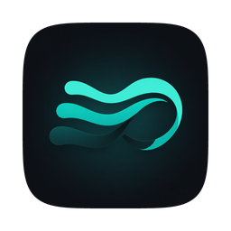
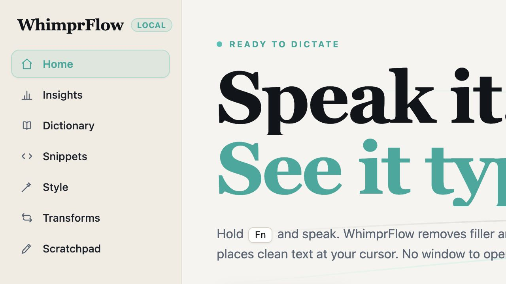
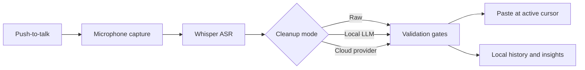

<p align="center">
  
</p>

<h1 align="center">WhimprFlow</h1>

<p align="center"><strong>Private voice dictation that keeps up with your thinking.</strong></p>

<p align="center">
  Hold a trigger, speak naturally, and receive polished text at the active cursor.<br />
  WhimprFlow is a local-first desktop dictation tool built with Rust, Tauri, and React.
</p>

<p align="center">
  <a href="#quick-start">Quick Start</a> · <a href="#capabilities">Capabilities</a> · <a href="#platform-notes">Platform Notes</a>
</p>

> **Project status:** Active development. The core desktop workflow is implemented, but this repository is not yet a signed, installer-ready release. See [Platform Notes](#platform-notes) for current boundaries.

## Product Preview

<p align="center">
  
</p>

The Hub is the command center for dictation preferences, personal vocabulary, snippets, transforms, shortcuts, and local usage insights. During dictation, a compact always-on-top Flow Bar communicates recording and cleanup state without interrupting the app you are working in.

## Why WhimprFlow

Voice input is only useful when it is fast, predictable, and safe to use in every application. WhimprFlow is designed around that loop:

1. Hold the push-to-talk trigger.
2. Speak in a natural, unstructured way.
3. Transcribe locally with Whisper.
4. Optionally clean the transcript with a local model or a cloud provider.
5. Validate the result, preserve a raw fallback, and place text at the active cursor.

## Capabilities

| Area | What it does |
| --- | --- |
| Local transcription | Uses `whisper.cpp` for on-device speech recognition. macOS uses Metal where available; Windows currently targets CPU execution. |
| Transcript cleanup | Supports raw output, local `llama.cpp` cleanup, and optional OpenAI-compatible or Anthropic cleanup paths. |
| Guardrails | Applies deterministic cleanup gates and can fall back to the raw transcript instead of silently over-editing. |
| Floating Flow Bar | Keeps the record, process, completion, and cancellation states visible above other apps. |
| Personal language | Provides a dictionary, snippets, style controls, transforms, and a scratchpad in the Hub. |
| Local insights | Tracks words dictated, dictation pace, time saved, streaks, and recent activity locally. |
| Secure configuration | Keeps cloud-provider credentials in the operating system credential store rather than plaintext configuration files. |

## Architecture



WhimprFlow separates portable product logic from platform-specific integration:

| Path | Responsibility |
| --- | --- |
| `crates/whimpr-core` | State machine, cleanup prompts and gates, dictionary logic, usage statistics. |
| `crates/whimpr-asr` | Whisper-backed speech recognition. |
| `crates/whimpr-audio` | Microphone capture and resampling. |
| `crates/whimpr-cleanup` | Cloud cleanup providers. |
| `crates/whimpr-llm-worker` | Local `llama.cpp` cleanup worker process. |
| `src-tauri` | Tauri shell, native shortcuts, text insertion, platform integration. |
| `ui` | React Hub and floating Flow Bar. |
| `docs` | Product notes, architecture, research, and implementation status. |

## Quick Start

### macOS

**Prerequisites:** Rust stable, Node.js, npm or pnpm, and Xcode Command Line Tools.

```bash
cd ui
pnpm install
cd ..
./dev.sh
```

To create an application bundle:

```bash
ui/node_modules/.bin/tauri build --bundles app
```

### Windows

**Prerequisites:** Rust stable with the MSVC toolchain, Node.js, npm or pnpm, CMake, LLVM/clang for `bindgen`, and Visual Studio Build Tools with the Desktop development with C++ workload.

If `bindgen` does not discover clang automatically, set `LIBCLANG_PATH` to clang's `bin` directory.

```powershell
cd ui
pnpm install
cd ..
ui\node_modules\.bin\tauri.CMD dev
```

For a release build:

```powershell
ui\node_modules\.bin\tauri.CMD build
```

## Models and Cleanup

Models are deliberately excluded from source control. Add a Whisper model and, if desired, a local GGUF cleanup model to the platform-specific model directory.

| Platform | Model directory |
| --- | --- |
| macOS | `~/Library/Application Support/WhimprFlow/models/` |
| Windows | `%APPDATA%\WhimprFlow\models\` |

Recommended inputs:

- A Whisper `ggml-*.en.bin` model, such as `ggml-base.en.bin`, from the [whisper.cpp model collection](https://huggingface.co/ggerganov/whisper.cpp).
- An optional GGUF instruction model for fully local cleanup.
- Or configure an OpenAI-compatible or Anthropic provider in the Hub to use cloud cleanup. Only the transcript is sent to that provider, never the captured audio.

## Privacy and Safety

- Audio capture and Whisper transcription run locally.
- Local cleanup remains on-device when a local GGUF model is configured.
- Cloud cleanup is optional and sends only text to the provider you select.
- API credentials are stored through the macOS Keychain or Windows Credential Manager.
- Cleanup is guarded against destructive rewrites, with raw-transcript fallback available when a result does not pass validation.

## Platform Notes

| Platform | Current state |
| --- | --- |
| macOS 14+ | Reference development target. Apple Silicon can use Metal-backed local inference. Accessibility and Microphone permissions are required for the full desktop workflow. |
| Windows 10/11 | Native build path and core workflow are present. Local Whisper and local cleanup are CPU-first today; GPU acceleration and additional production hardening remain future work. |

The project still needs packaging, code-signing, notarization, broader device testing, and additional error recovery before it should be treated as production software.

## Development

Useful checks while developing:

```bash
# Frontend production build
cd ui && npm run build

# Rust workspace checks
cargo check --workspace
```

Keep user-facing copy free of em dashes and prefer clear punctuation such as commas, colons, or parentheses. The project uses ASCII-first source text unless a character is required for the product experience.

## Contribution and Attribution

Contributions that improve reliability, accessibility, platform support, test coverage, and local model performance are useful.

WhimprFlow is independent software. It is not affiliated with, endorsed by, or connected to Wispr Flow or any other product. The application uses its own codebase, branding, iconography, and user interface.

## License

MIT. See [LICENSE](LICENSE).
